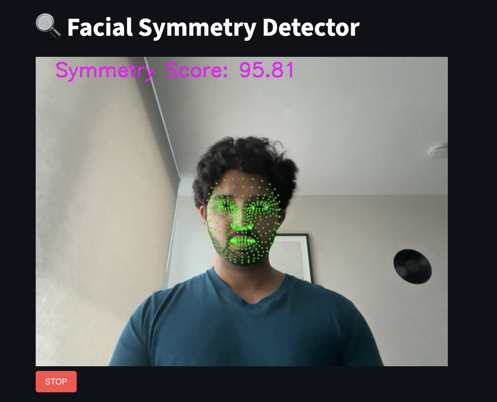

# Face Symmetry Detector

A real-time facial symmetry detection web app using Streamlit, MediaPipe, and OpenCV.

---


## Demo




---

## Features

- Detects face and facial landmarks in webcam video stream.
- Calculates a facial symmetry score based on distances of symmetrical landmarks.
- Applies smoothing to the symmetry score for stable real-time display.
- Simple, interactive UI powered by Streamlit.

---

## Requirements

- Python 3.7+
- Streamlit
- OpenCV
- MediaPipe
- streamlit-webrtc
- numpy

---

## Installation

1. Clone the repository:

```bash
git clone https://github.com/yourusername/face-symmetry-detector.git
cd face-symmetry-detector
python3 -m venv venv
source venv/bin/activate  # macOS/Linux
venv\Scripts\activate     # Windows

pip install -r requirements.txt # install requirements
streamlit run app.py # To run the app
